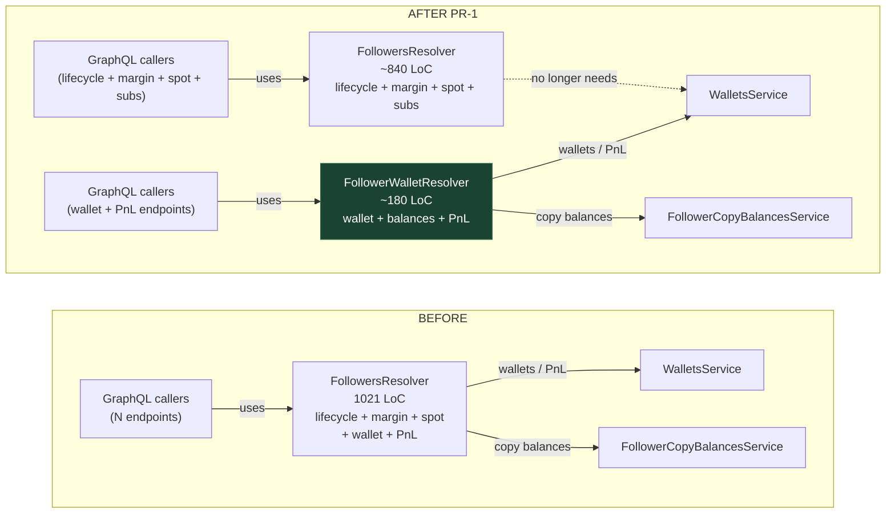

Takes: `<DEC-N|N|ALL>` optionally followed by `<PR-M|M|next>` and optional flags.

## Argument forms

### Single-PR mode (default — safest)

- `/arch-execute 4` → PR-1 of DEC-004: worktree → implement → test → commit → push → remove. Rich preview + per-PR `yes/no/show more/tweak` prompt.
- `/arch-execute DEC-004 PR-2` → PR-2 specifically, same flow.
- `/arch-execute 4 next` → explicit "next unexecuted PR".

### Fire-and-forget mode

- `/arch-execute 4 --auto` → **all remaining PRs of DEC-004 sequentially, stacked on ONE branch `refactor/DEC-004-<slug>`**. Single preview up front showing the whole DEC, then one `yes-all` and the plugin marches through every PR without further prompts. Tests + build run between each PR. One worktree for the whole DEC, one branch, N commits, one push at the end.
- `/arch-execute ALL --auto` → every DEC in `docs/decomposition/` that has unexecuted PRs, each in its own worktree and branch, done sequentially. One preview per DEC, one `yes-all-decs` at the top, then the plugin ships the whole queue.

### Flag modifiers

- `--no-push` → commit only; do not push, do not remove the worktree.
- `--keep` → push, but keep the worktree on disk for manual review.
- `--inplace` → mutate current checkout instead of a worktree; commits locally, does not push. Incompatible with `--auto` (refuse with a message).
- `--base <branch>` → base the refactor branch off `<branch>` instead of the repo default.

Flags combine: `/arch-execute 4 --auto --keep --base develop`.

## Steps

### 1. Resolve the DEC file and PR

- Normalize id: `4` → `DEC-004`, globbed at `docs/decomposition/DEC-<padded>-*.md`. If missing → stop and say "run `/arch-decompose` first".
- Parse: Target, chosen Pattern, full PR sequence, Execution log.
- If PR not given, pick the lowest PR not in the Execution log. If all done → stop and say so.

### 2. Provision isolated worktree (default)

**Skip this whole section if `--inplace` was passed.**

**Run every git operation directly via the `Bash` tool. Never write a temporary shell script in `/tmp` or anywhere else — no `create-wt.sh`, no `setup.sh`, no scaffolding files. One `Bash` call per git command, or chain with `&&` if they depend on each other. Scripts are unreviewable noise; inline commands show the user exactly what is happening.**

- Derive paths in a single `Bash` invocation (shell variables in one call):
  ```bash
  REPO_ROOT="$(git rev-parse --show-toplevel)"
  REPO_NAME="$(basename "$REPO_ROOT")"
  WORKTREES_DIR="$REPO_ROOT/../${REPO_NAME}.worktrees"
  WT_PATH="$WORKTREES_DIR/DEC-<padded>-pr-<M>-<slug>"
  BRANCH="refactor/DEC-<padded>-pr-<M>-<slug>"   # slug kebab-case, ≤ 40 chars
  ```
- Resolve the base branch: first of `--base <name>` / `.arch-profile.yaml` `default-branch:` / `origin/HEAD` / `main` / `master` that exists. Check with `git show-ref --verify --quiet refs/heads/<name>` chained via `||`.
- Create the sibling dir and the worktree in one shot:
  ```bash
  mkdir -p "$WORKTREES_DIR" && git worktree add -b "$BRANCH" "$WT_PATH" "$BASE"
  ```
- If `"$WT_PATH"` already exists: ask the user whether to reuse, blow away (`git worktree remove --force "$WT_PATH"`), or abort — then run the chosen command directly. Do NOT materialize a wrapper script for the choice.
- `.arch-profile.yaml` is tracked in git, so it's already in the worktree via the checkout. If by accident it's untracked in the main repo, `cp "$REPO_ROOT/.arch-profile.yaml" "$WT_PATH/"`.
- **The user's original checkout is never modified.**

### 3. Preflight (inplace mode only)

- `git status --porcelain` — if non-empty, stop and say: "Working tree has uncommitted changes. Either commit/stash them, drop `--inplace`, or pass `--inplace --force` (not recommended)."
- If on main/master, warn and suggest a named branch.

### 4. Display scope + confirm (rich preview)

**Critical — do NOT re-analyze the codebase here.** The DEC file is the plan of record. It was produced by `/arch-decompose` after a full hotspot analysis of the target. Reading the source again, grepping for callers, checking where symbols are registered, etc. — all of that work was already done and is captured in the DEC. Repeating it wastes a turn and risks diverging from the agreed plan.

**Render the preview purely from the DEC file's contents.** Extract:

- **Architecture before/after** — take the Mermaid from Section 3 of the DEC ("Target architecture"). If the DEC only has an after-diagram, infer the before-diagram from the DEC's Evidence table (current LoC, responsibility count) — no code reads.
- **Files touched** — from the DEC's PR-<M> entry in Section 4 (PR sequence). If the DEC lists file paths there, use them. If it's high-level ("extract avatar service"), derive file names by convention (`<module>/services/<new-name>.service.ts`) — still no code reads.
- **What moves** — from the DEC's Section 1 (Evidence → responsibility clusters) matched to this PR's scope.
- **Callers that continue to work** — from the DEC's backward-compat notes or the Pattern section (Strangler / Branch-by-Abstraction plans always list these). If the DEC did not record callers, write "callers: per DEC — delegation preserves the public API" rather than grepping.
- **Tests** — from the DEC's Section 8 (Success criteria) and any Tests subsection if present.
- **Risks + alternatives** — directly from Sections 2 and 7 of the DEC.

The **only** new work allowed at this step is rendering these into the preview format. If a field is genuinely missing from the DEC (rare — the decomposer should have captured it), state that explicitly in the preview: `(not captured in DEC — will re-check in Step 5)`. Do not silently go fill the gap by reading source.

Produce a fully-visualized preview **before** asking for confirmation. Sections in this order:

#### Header

> **DEC-<padded> · PR-<M>/<total> — <PR title>**
> Pattern: <pattern from DEC>
> Estimated diff: ~<N> LoC across <K> files

#### Architecture — before → after

Mermaid `flowchart LR` with two subgraphs showing the relevant slice of the module. The diagram must answer three questions at a glance:

1. **Who calls the unit** — upstream callers (GraphQL clients, HTTP handlers, other services)
2. **What the unit does and how big it is** — LoC and the bundled responsibilities
3. **What changes in this PR** — which piece gets extracted, which edges get redirected, where delegation flows

**Mermaid syntax that works** — strict rules, because the renderer is unforgiving:

- Line breaks inside a node label: use **`<br/>`**, never `\n` (literal `\n` will show up in the rendered box).
- Keep labels short — 3 lines max per node. Long labels wrap unpredictably.
- Every edge needs a label unless it is trivial:
  - solid labeled edge: `A -->|"calls"| B`
  - dashed labeled edge (delegation / extraction): `A -.->|"delegates to"| B`
  - bare arrow `-->` is only OK for "calls" where the direction is self-evident
- Node IDs (b1, a1, etc.) must be unique across both subgraphs. Reusing an id in BEFORE and AFTER merges them into one node.
- Put the extracted unit on the AFTER side only. Highlight it with `style` for clarity.

**Canonical template** — adapt labels, keep the structure:



Adapt:

- **Pattern = Extract Resolver / Module / Service**: two units on the AFTER side, callers routed to the new unit for the extracted concern, old unit loses those outbound edges.
- **Pattern = Extract Port**: old unit stays, AFTER shows new interface between old unit and the concrete adapter; delegation is dashed.
- **Pattern = Strangler Fig**: a router/facade node appears on AFTER, dashed edges to both old and new with percentages ("50% traffic").

If the DEC does not contain enough information to draw callers (rare — `/arch-decompose` should have captured them), draw a single generic `clients[...]` node and note `(callers not enumerated in DEC)` under the diagram rather than inventing them.

Keep it small — the slice of the repo this PR actually changes, not the whole system.

#### Files touched

Table with clickable repo-root-relative links:

| Action | File                                                                                 | Reason                  |
| ------ | ------------------------------------------------------------------------------------ | ----------------------- |
| CREATE | [`portfolio-avatar.service.ts`](src/portfolios/services/portfolio-avatar.service.ts) | new seam                |
| MODIFY | [`portfolios.service.ts`](src/portfolios/portfolios.service.ts)                      | delegate avatar methods |

#### What moves

Inline-code list of symbols / methods being relocated, grouped by intent.

#### Callers that continue to work (backward compat)

Bullet per caller with clickable link, one line why it stays green.

#### Tests

- **Existing pins** — tests that lock current behaviour, with `[file.ts:line](path#Lline)` links.
- **New tests this PR adds** — one bullet per spec.
- **Gaps** — behaviour not currently covered; flag as risk.

#### Risks + mitigation

One risk per line, colon-separated from its mitigation.

#### Alternatives considered (from the DEC)

- **Chosen**: <pattern> — why.
- **Rejected**: <alt> — why not.

#### Destination

- Worktree: `<WT_PATH>` (worktree mode) OR current checkout (inplace)
- Branch: `<BRANCH>`
- Base: `<BASE>`

#### Ask

Pick the prompt based on mode:

**Single-PR mode (default):**

```
Ready to implement? Reply with one of:
  yes                         — proceed with this PR
  yes-all                     — implement ALL remaining PRs of this DEC (auto mode)
  no                          — abort, no changes
  show more                   — dump the full PR section from the DEC file
  tweak: <what to change>     — adjust the plan, I'll re-preview
```

**`--auto` mode for one DEC (user passed `--auto` up front OR just replied `yes-all`):**

```
Auto-mode: implement PR-1..PR-<total> of DEC-<id> sequentially on one branch
`refactor/DEC-<id>-<slug>`. Tests + build run between each PR. No further
prompts — I'll commit per PR and push once at the end. Reply:
  yes-all                     — go
  no                          — abort
```

**`ALL --auto` mode across every DEC:**

```
Queue: <N> DECs with <M> total unexecuted PRs. Each DEC gets its own worktree
and branch. I'll process them in order and stop on the first failure.
  yes-all-decs                — go
  no                          — abort
```

On `tweak: <...>`: re-derive the affected sections and print the preview again. Loop until one of the terminal responses.

### 5. Implement

Touch the session approval marker at `${TMPDIR:-/tmp}/architecture-first/<md5($WT_PATH or $REPO_ROOT)>-<session_id>.approved` so the hook allows edits.

In **worktree mode**, treat the worktree as the active project: all subsequent `Edit`/`Write` calls use absolute paths under `$WT_PATH`; `Bash` commands run with `cd "$WT_PATH" && …`.

Produce the code per the PR plan. No re-planning — the DEC is the plan of record.

### 5-auto. Implement (auto-mode — for `--auto` / `yes-all` / `yes-all-decs`)

Auto-mode ships an entire DEC (or an entire queue of DECs) on a single branch per DEC, with N commits, without prompting between PRs.

**For one DEC (`--auto` / `yes-all`):**

1. Worktree path + branch in auto-mode use the DEC-level slug, not the PR-level slug:
   - `WT_PATH = <repo>.worktrees/DEC-<padded>-<slug>`
   - `BRANCH  = refactor/DEC-<padded>-<slug>`
2. Create the worktree once (same `git worktree add -b "$BRANCH" "$WT_PATH" "$BASE"` as single-PR mode).
3. For each unexecuted PR in order:
   a. Implement the PR's scope inside `$WT_PATH`. DEC is the plan of record — no re-analysis.
   b. Run `commands.test` and `commands.build` from the worktree. On **any failure**: stop the whole auto-run, leave the worktree on disk with the commits done so far, report which PR failed and the first 40 lines of output, do NOT push. User can fix manually and `/arch-execute <N> PR-<failed> --inplace` from inside the worktree.
   c. On green: `git add -A && git commit -m "refactor(<scope>): <PR title> [DEC-<padded> PR-<M>/<total>]"`.
   d. Append Execution log in the ORIGINAL checkout's DEC file with date, sha, branch, test/build status, and `auto: true`. Do this per-PR so progress is visible even if the run aborts mid-way.
4. After the final PR commits cleanly: one `git push -u origin "$BRANCH"`, then `git worktree remove "$WT_PATH"` (unless `--keep` / `--no-push`).
5. Report: DEC done, N PRs shipped, branch on origin, GitHub compare URL.

**For every DEC (`ALL --auto` / `yes-all-decs`):**

1. Enumerate `docs/decomposition/DEC-*.md` with `Status: proposed` or with any unexecuted PRs. Order by DEC number unless the summary table specifies a different order.
2. For each DEC in the queue, run the single-DEC `--auto` flow above. Each DEC gets its own worktree + branch, independent of the others (all branched from the same base — no stacking across DECs).
3. Stop the entire queue on the first DEC's first failure. Report which DEC + PR failed, what's been done, and what remains.
4. Final report: a table of all DECs processed with their branches, commit counts, and GitHub compare URLs.

Between PRs of the same DEC the hook's edit-gate marker from step 5 stays valid (same session, same worktree) — no need to re-approve. Mass-deletion gate can still fire if a single PR removes ≥ 200 lines; in that case the auto-run pauses, tells the user to run `/arch-clean-approve` for the batch, and waits for confirmation before continuing.

### 6. Verify

Read `commands.test` and `commands.build` from `.arch-profile.yaml` at the active path. Run both inside the worktree (or current dir for inplace). If either fails:

- worktree: leave it on disk for inspection, report failure with first 40 lines of output.
- inplace: `git restore .` and report.

### 7. Commit

On green, inside the active path:

- `git add -A`
- `git commit -m "refactor(<scope>): <PR title> [DEC-<padded> PR-<M>/<total>]"`

### 7a. Auto-push (worktree mode default)

Unless `--no-push` was passed OR mode is inplace, push the branch:

- `git push -u origin "$BRANCH"` (from within the worktree)
- If push **fails** (auth, non-fast-forward, protected branch, network, etc.): leave the worktree alive, skip removal, report the git error with its first 20 lines, and tell the user exactly how to retry — `cd "$WT_PATH" && git push -u origin "$BRANCH"`. Still proceed to step 8 to record the commit in the DEC execution log (so the work is not lost).
- If push **succeeds**: continue to step 7b.

### 7b. Auto-remove worktree (worktree mode default)

Unless `--keep` was passed OR push failed OR mode is inplace:

- Return to the main checkout: `cd "$REPO_ROOT"`.
- `git worktree remove "$WT_PATH"` — removes the worktree directory and cleans up `.git/worktrees/` metadata. The branch itself stays in the local repo and tracks `origin/<BRANCH>`.
- If removal fails (e.g. nested untracked files the user added): report the error and tell the user how to force it (`git worktree remove --force "$WT_PATH"`) — do NOT force automatically.

The refactor is now:

- committed locally ✓
- pushed to origin ✓
- available as a branch for opening a PR ✓
- not sitting in a leftover directory ✓

### 8. Update the DEC file

Append the Execution log (in the ORIGINAL checkout's DEC file, not the worktree's — the source of truth is the user's main checkout):

```
- PR-<M> executed <YYYY-MM-DD>, commit <sha> on <branch> (worktree: <path>) — tests ✓, build ✓
```

### 9. Report

Pick the shape that matches what actually happened:

**Full auto (default happy path):**

```
✓ PR-<M>/<total> done.
  branch:   refactor/DEC-001-pr-1-portfolio-service
  commit:   <sha>
  pushed:   origin/refactor/DEC-001-pr-1-portfolio-service
  worktree: removed

Open a PR on GitHub:
  https://github.com/<org>/<repo>/compare/refactor/DEC-001-pr-1-portfolio-service?expand=1
  (or: gh pr create --fill)

Next PR: /arch-execute <id> PR-<M+1>
```

**`--no-push` or push failed:**

```
✓ PR-<M>/<total> implemented, but not pushed.
  worktree: <WT_PATH>
  branch:   <BRANCH>
  commit:   <sha>

Push when ready:
  cd <WT_PATH>
  git push -u origin <BRANCH>

After merge, clean up:
  git worktree remove <WT_PATH>
```

**`--keep`:**

```
✓ PR-<M>/<total> done, worktree kept for review.
  branch:   <BRANCH>
  commit:   <sha>
  pushed:   origin/<BRANCH>
  worktree: <WT_PATH> (kept)

After you're done with it:
  git worktree remove <WT_PATH>
```

**Inplace mode:** user is already on the branch, commit done, no push. Mention the branch name and remind them to push.

If this was the final PR of the DEC, update the file header `Status:` to `done` and add a concluding line to Execution log.
