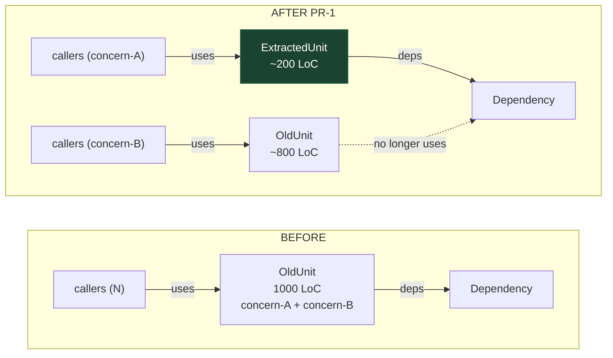

# /arch-execute rich preview — templates

Loaded only when `/arch-execute` actually renders a preview. Keeps the command file lean.

## Mermaid before→after template

Strict syntax: ` ` for line breaks (never `\n`), labeled edges, unique node IDs across subgraphs, style the new unit.

## Pattern adaptations

- **Extract Module/Service/Resolver** — two units on AFTER; callers routed to the new unit for the extracted concern; old unit loses those outbound edges.
- **Extract Port** — old unit stays; AFTER shows new interface between old unit and concrete adapter; delegation is dashed.
- **Strangler Fig** — router/facade node on AFTER; dashed edges to both old and new with traffic percentages.

## Preview sections (in order)

1. Header: DEC-N · PR-M/total — title; Pattern; estimated diff
2. Mermaid before→after (above)
3. Files touched table — clickable `[file](path)` links, columns: Action | File | Reason
4. What moves — symbols grouped by intent
5. Callers that continue to work — bullet + link + why stays green
6. Tests — existing pins (with `[file:line](path#Lline)`), new, gaps
7. Risks + mitigation
8. Alternatives considered (chosen vs rejected, from DEC)
9. Destination — worktree / branch / base
10. Ask prompt
