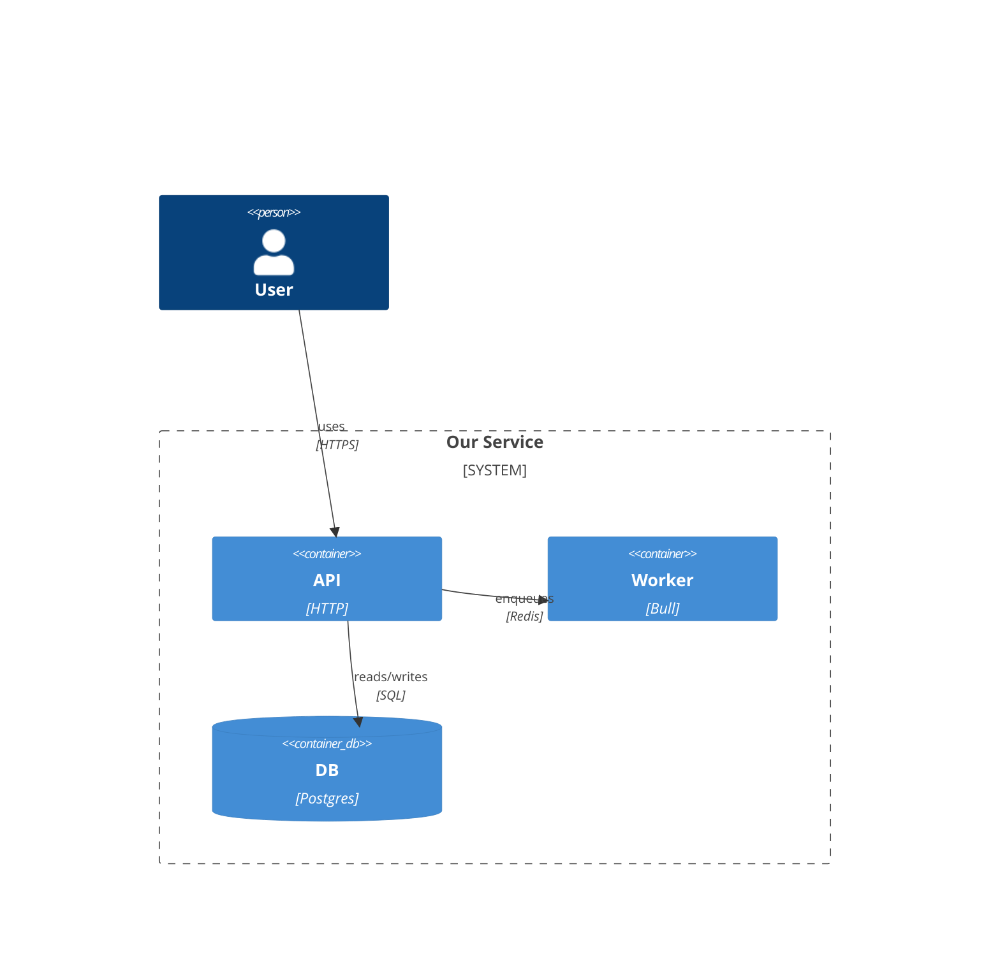

# C4 model — level-of-detail rules

Use the _smallest_ level that answers the question; do not draw every level every time.

## Level 1 — System Context

Use when the change touches how our system talks to the outside world (users, external services, third-party APIs). Shows: users, our system, external systems. No internal detail.

## Level 2 — Containers

Use for cross-container changes (web ↔ worker ↔ external service). Shows: each deployable (HTTP API, worker, UI, database, cache, queue, external service). Arrows = protocols (HTTP, gRPC, Socket.IO, SQL, Redis pub/sub, message bus).

## Level 3 — Components

Use for in-repo module design. Shows: modules and their key components. Arrows = imports and event/message subscriptions. Flag any cycle.

## Level 4 — Code

Rarely needed in conversation. Fall back to a file tree + key class signatures.

## Conventions (Mermaid)

For simpler cases, a `flowchart` is enough — see `mermaid-cheatsheet.md`.
