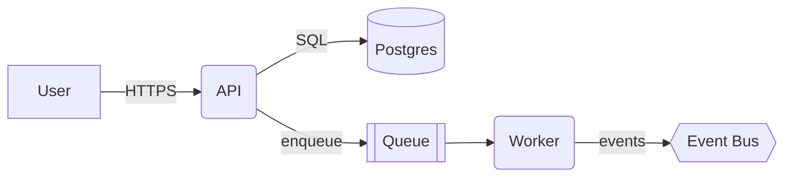
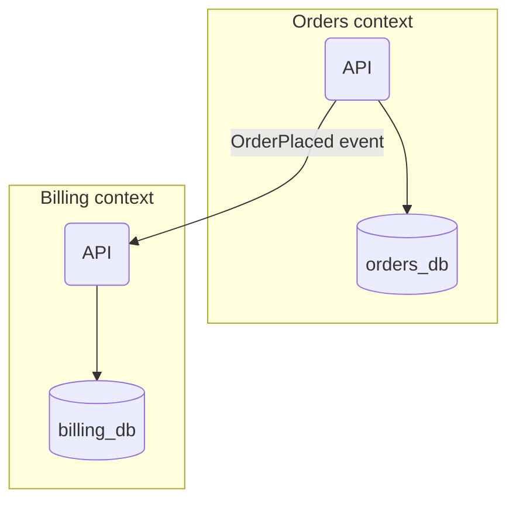
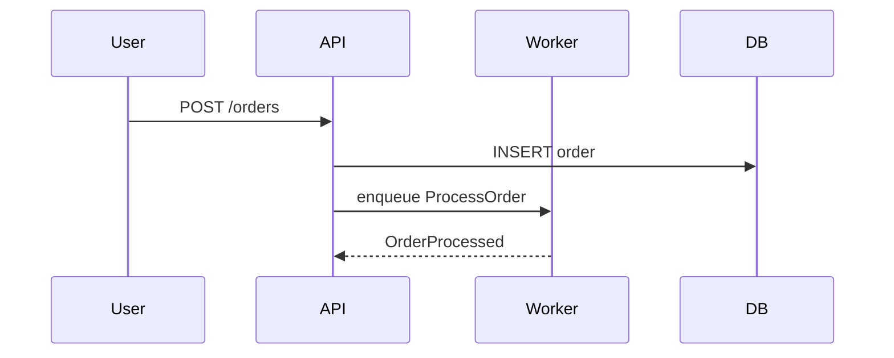

# Mermaid cheat sheet

Enough Mermaid to draw any architectural diagram this plugin produces. Prefer `flowchart` for most cases; fall back to `C4Container` / `sequenceDiagram` when they pay off.

## Flowchart (default choice)

- `[text]` — rectangle (container, process).
- `(text)` — rounded (component, module).
- `[(text)]` — cylinder (database).
- `[[text]]` — subroutine (queue, topic).
- `{{text}}` — hexagon (bus, broker).
- `{text}` — rhombus (decision).

## Subgraphs (modules / bounded contexts)

## Sequence diagram (for flows across containers)

## Rules of thumb

- One diagram per response. Never two in one section.
- Label every edge with the protocol or event name.
- Dashed edge for async / best-effort; solid for synchronous / transactional.
- If you need three colours to explain it, the diagram is wrong — split it.
