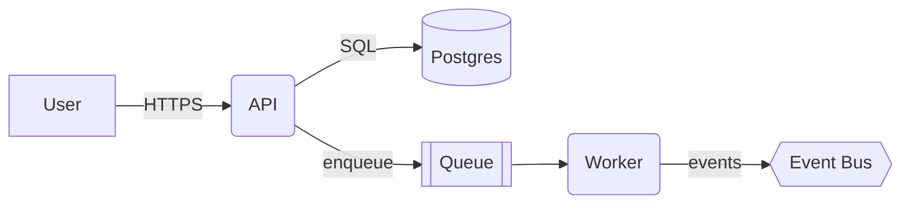
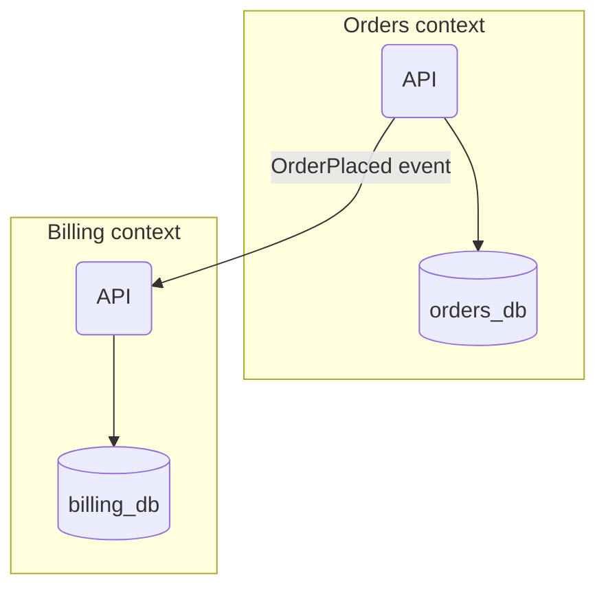
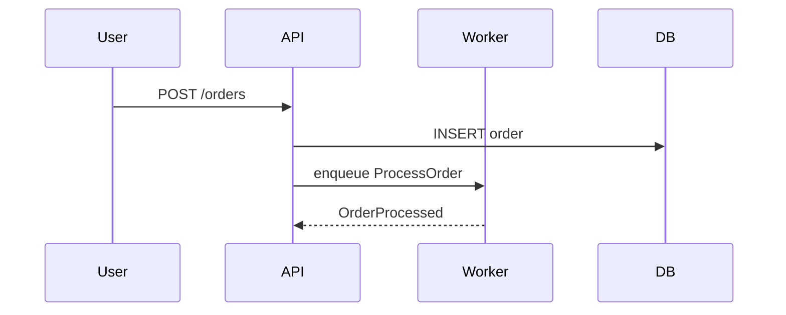
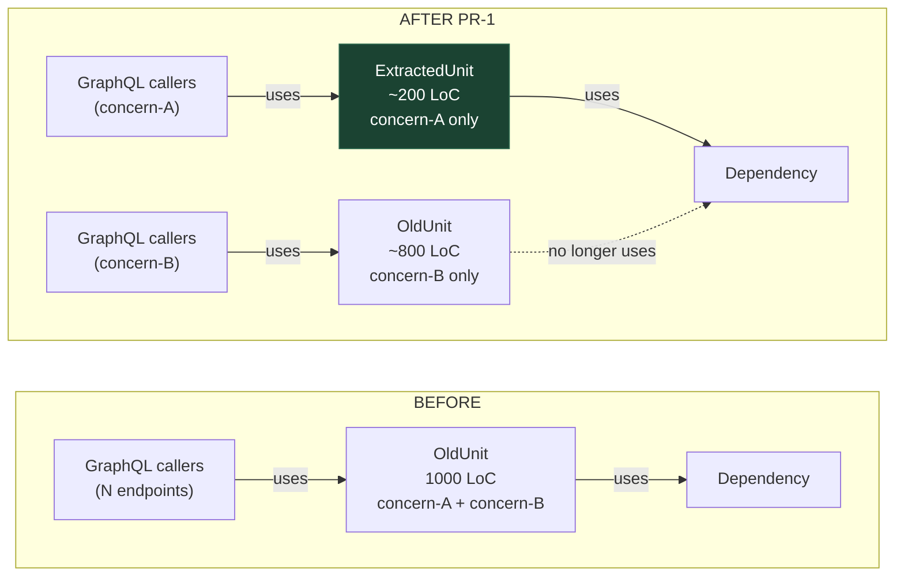

# Mermaid cheat sheet

Enough Mermaid to draw any architectural diagram this plugin produces. Prefer `flowchart` for most cases; fall back to `C4Container` / `sequenceDiagram` when they pay off.

## Flowchart (default choice)

- `[text]` — rectangle (container, process).
- `(text)` — rounded (component, module).
- `[(text)]` — cylinder (database).
- `[[text]]` — subroutine (queue, topic).
- `{{text}}` — hexagon (bus, broker).
- `{text}` — rhombus (decision).

## Subgraphs (modules / bounded contexts)

## Sequence diagram (for flows across containers)

## Rules of thumb

- One diagram per response. Never two in one section.
- Label every edge with the protocol or event name.
- Dashed edge for async / best-effort; solid for synchronous / transactional.
- If you need three colours to explain it, the diagram is wrong — split it.

## Syntax gotchas (the ones that actually bite)

- **Line breaks inside node labels: use ` `, never `\n`.** A quoted label like `"Foo\nBar"` renders with a literal `\n` in the box. Use `"Foo Bar"` instead.
- **Node IDs are global within a diagram.** Defining `r1[…]` in `subgraph BEFORE` and `r1[…]` in `subgraph AFTER` merges them into one node spanning both subgraphs. Use distinct IDs per side (`rB` vs `rA`, or `beforeResolver` vs `afterResolver`).
- **Quote labels with spaces or special characters.** `A[My Label]` sometimes works, `A["My Label"]` always works.
- **Edge labels need the pipe form** `A -->|"label"| B` — not `A -->"label" B`.
- **Styling a node** uses a separate statement, not inline: `style nodeId fill:#1b4332,stroke:#2d6a4f,color:#fff`.
- **`direction LR` inside a subgraph** fixes weird vertical layout when the outer flowchart is also `LR`.

## Before → after pattern (for `/arch-decompose` and `/arch-execute`)

